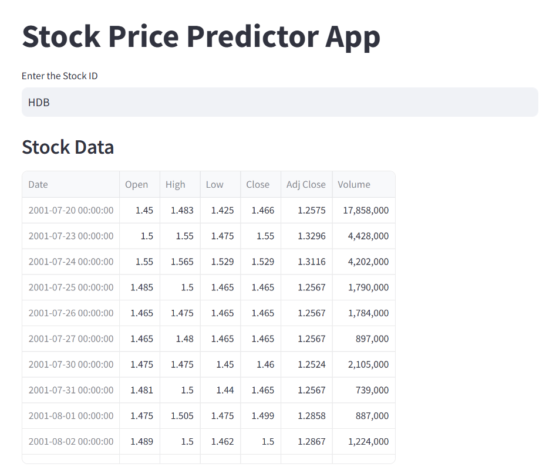
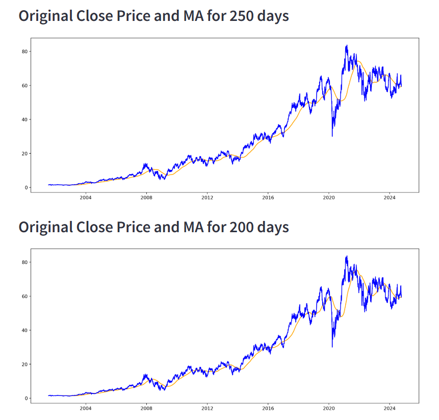
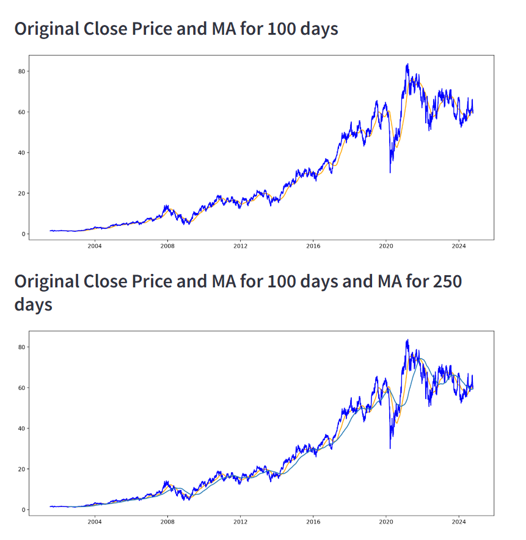
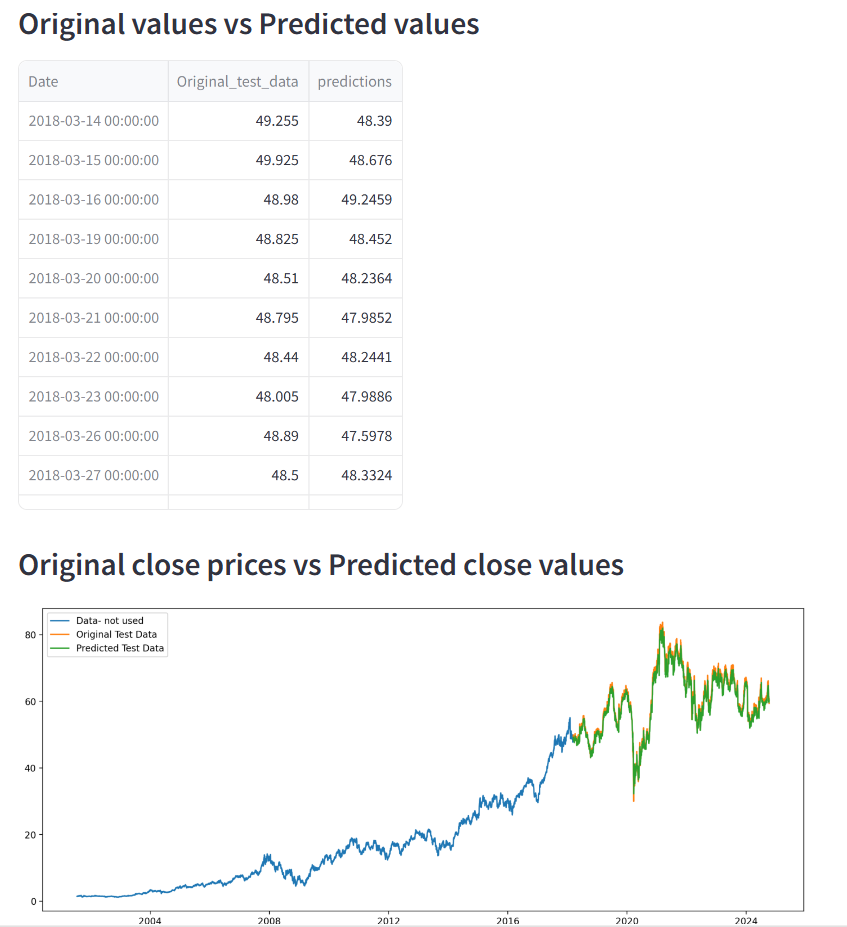

<h1>STOCK PRICE PREDICTION USING ML</h1>

## Overview
Designed and developed a stock price predictor app that leverages machine learning algorithms to forecast future stock prices based on historical data. The app integrates time series analysis with models such as LSTM (Long Short-Term Memory) and Dense to predict stock price movements.

## Key Features
- **Real-time Data Fetching:** The app fetches the latest stock prices in real-time.
- **Data Visualization:** Interactive graphs to visualize stock price trends and predictions.
- **Model Performance Comparison:** Evaluation of different models based on metrics like RMSE (Root Mean Square Error).
- **User Insights:** Provides insights into market trends and potential investment opportunities.

## Technologies Used
- **Programming Language:** Python

- **Libraries:**
  - Pandas
  - Scikit-learn
  - Keras
    
## Installation
To set up the project locally, follow these steps:

1. **Clone the repository:**
   ```bash
   git clone https://github.com/Deepanshu8560/Stock-Price-Prediction-Using-ML.git
2. **Navigate to the project directory:**
   ```bash
   cd Stock-Price-Prediction-Using-ML
3. **Install the required libraries:**
   ```bash
   pip install -r requirements.txt
## Usage
1. **Open the Jupyter Notebook:**
   ```bash
   jupyter notebook stock_price.ipynb

2. Run the cells to fetch data, train the model, and visualize predictions.

## Contributing
- Contributions are welcome! Please feel free to submit a pull request or open an issue for any suggestions or improvements.






