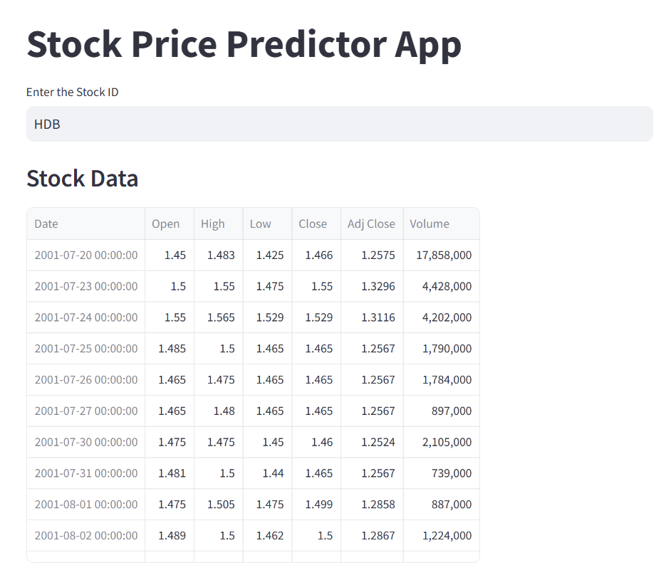

<h1>STOCK PRICE PREDICTION USING ML</h1>

Designed and developed a stock price predictor app that leverages machine learning algorithms to forecast future stock prices based on historical data. The app integrates time series analysis with models such as LSTM (Long Short-Term Memory), and Dense to predict stock price movements. Key features include real-time data fetching, data visualization through interactive graphs, and model performance comparison based on metrics like RMSE. Built using Python, the app utilizes libraries such as Pandas, Scikit-learn, and Keras, and provides users with insights into market trends and potential investment opportunities. The app is designed for ease of use, with an intuitive interface and reliable performance.

